# Vigil v1.0 -- Getting Started

## Installation

### Option 1: Docker (Recommended)

The fastest way to get Vigil running with all security tools pre-installed.

```bash
# Clone the repo
git clone https://github.com/your-org/vigil.git
cd vigil

# Copy environment template
cp .env.example .env

# Start with Docker Compose
docker compose up -d

# Access at http://localhost:4100
# Default login: set `VIGIL_USER`/`VIGIL_PASS`, or read the generated bootstrap password from the startup logs
```

Docker Compose starts two services:
- **vigil** -- the application on port 4100
- **postgres** -- PostgreSQL 17 database

The Vigil container includes nmap, nuclei, trivy, nikto, and OpenSSL pre-installed.

To pass your Docker socket for container scanning:
```bash
# Linux/Mac (default in docker-compose.yml)
# /var/run/docker.sock is mounted automatically

# If your Docker group GID is not 0:
DOCKER_GID=$(getent group docker | cut -d: -f3) docker compose up -d
```

### Option 2: Bare Metal (Ubuntu/Debian)

For full control and best scanner performance.

```bash
# 1. Install Node.js 22
curl -fsSL https://deb.nodesource.com/setup_22.x | sudo -E bash -
sudo apt-get install -y nodejs build-essential

# 2. Install security scanners
sudo apt-get install -y nmap nikto dnsutils whois openssl

# 3. Install Nuclei
GO_NUCLEI_VER=$(curl -sL https://api.github.com/repos/projectdiscovery/nuclei/releases/latest | grep tag_name | cut -d'"' -f4 | tr -d v)
curl -sL "https://github.com/projectdiscovery/nuclei/releases/latest/download/nuclei_${GO_NUCLEI_VER}_linux_amd64.zip" -o /tmp/nuclei.zip
sudo unzip -q /tmp/nuclei.zip -d /usr/local/bin/ && rm /tmp/nuclei.zip

# 4. Install Trivy
curl -sfL https://raw.githubusercontent.com/aquasecurity/trivy/main/contrib/install.sh | sudo sh -s -- -b /usr/local/bin

# 5. (Optional) Install PostgreSQL 17
sudo sh -c 'echo "deb http://apt.postgresql.org/pub/repos/apt $(lsb_release -cs)-pgdg main" > /etc/apt/sources.list.d/pgdg.list'
curl -fsSL https://www.postgresql.org/media/keys/ACCC4CF8.asc | sudo gpg --dearmor -o /etc/apt/trusted.gpg.d/pgdg.gpg
sudo apt-get update && sudo apt-get install -y postgresql-17

# 6. (Optional) Install Docker for container scanning
curl -fsSL https://get.docker.com | sudo sh

# 7. (Optional) Install AI CLIs
sudo npm install -g @anthropic-ai/claude-code @openai/codex

# 8. Install and start Vigil
cd vigil
cp .env.example .env
npm install
npm start
```

### Option 3: Quick Install (npm only)

Minimal setup -- scanners are optional. Vigil degrades gracefully when tools are missing.

```bash
cd vigil
cp .env.example .env
npm install
npm start
# Access at http://localhost:4100
```

Without scanners installed, scanning views will show "Scanner not found" messages but the rest of the platform (dashboard, assets, incidents, compliance, reports) works normally.

---

## First Login

1. Open http://localhost:4100 in your browser
2. Sign in with the `VIGIL_USER`/`VIGIL_PASS` you configured, or use the generated bootstrap password shown in the startup logs
3. You will land on the Dashboard view showing your security posture score

**Change your password immediately** after first login via Settings > Account.

---

## Security Setup

### Change Default Password

1. Click **Settings** in the sidebar
2. Go to the **Account** tab
3. Enter your current password and your new password
4. Click **Update Password**

### Enable Two-Factor Authentication (2FA)

1. Click **Settings** in the sidebar
2. Go to the **Security** tab
3. Click **Enable 2FA**
4. Scan the QR code with your authenticator app (Google Authenticator, Authy, etc.)
5. Enter the 6-digit code to verify
6. Save your backup codes in a secure location

---

## Running Your First Scan

### Network Scan (Nmap)

1. Click **Network Scan** in the sidebar
2. Enter a target (IP address, hostname, or CIDR range)
3. Select a scan profile:
   - **Quick** -- top 100 ports, fast
   - **Standard** -- top 1000 ports, service detection
   - **Full** -- all 65535 ports, OS detection, scripts
   - **Stealth** -- SYN scan, slower but less detectable
4. Click **Start Scan**
5. Results appear in real-time as ports are discovered

### Vulnerability Scan (Nuclei)

1. Click **Vuln Scan** in the sidebar
2. Enter a target URL or IP
3. Select severity filter (critical, high, medium, low, info)
4. Optionally select specific template categories
5. Click **Start Scan**
6. Findings are grouped by severity with remediation links

### Container Scan (Trivy)

1. Click **Container Scan** in the sidebar
2. Select scan type:
   - **Image** -- scan a Docker image by name/tag
   - **Filesystem** -- scan a local directory
   - **Repository** -- scan a git repository
3. Enter the target
4. Click **Start Scan**
5. Results show CVEs, misconfigurations, and secrets found

### SSL Audit (OpenSSL)

1. Click **SSL Audit** in the sidebar
2. Enter a hostname (e.g., example.com)
3. Click **Analyze**
4. View certificate chain, cipher suites, protocol support, and expiry info
5. Overall grade (A+ to F) is displayed based on configuration

### DNS Recon

1. Click **DNS Recon** in the sidebar
2. Enter a domain name
3. Select record types (A, AAAA, MX, NS, TXT, SOA, CNAME)
4. Click **Lookup**
5. Optionally run WHOIS lookup or zone transfer test

---

## Using AI Features

Vigil uses a BYOK (Bring Your Own Key) model -- you use your own AI subscription. The platform shells out to locally installed CLI tools, so there is zero AI cost to the product itself.

### Setup

1. Install an AI CLI tool:
   - `npm install -g @anthropic-ai/claude-code` (requires Anthropic subscription)
   - `npm install -g @openai/codex` (requires OpenAI API key)
2. Go to **Settings** > **AI Provider**
3. Select your provider (Claude CLI, Claude Code, Codex CLI, or None)
4. Set your API key in environment or the provider's own config

### AI-Powered Features

- **Vulnerability Triage** -- AI prioritizes findings by exploitability and business impact
- **Remediation Guidance** -- AI generates step-by-step fix instructions
- **Incident Playbooks** -- AI creates response procedures from incident context
- **Compliance Analysis** -- AI identifies gaps against SOC2/PCI-DSS/HIPAA/ISO27001
- **Scan Summaries** -- AI summarizes scan results into executive briefings
- **Threat Briefings** -- AI correlates threat intel with your asset inventory
- **Postmortem Reports** -- AI drafts post-incident review documents
- **Natural Language Queries** -- type plain English to generate scanner commands

---

## MCP Server Connection

Vigil includes a built-in MCP (Model Context Protocol) server that lets AI assistants interact with your security data.

### Connect from Claude Desktop

Add to your Claude Desktop config (`claude_desktop_config.json`):

```json
{
  "mcpServers": {
    "vigil": {
      "url": "http://localhost:4100/mcp",
      "headers": {
        "Authorization": "Bearer YOUR_SESSION_TOKEN"
      }
    }
  }
}
```

### Connect from Claude Code / Cursor / VS Code

```bash
# Claude Code
claude mcp add vigil --transport http http://localhost:4100/mcp

# Cursor / VS Code (MCP extension)
# Add to .mcp.json in your project root:
{
  "servers": {
    "vigil": {
      "url": "http://localhost:4100/mcp"
    }
  }
}
```

### Available MCP Operations

- **Tools** (25+): Run scans, search CVEs, list assets, manage incidents, generate reports
- **Resources**: Security posture overview, scan summary, vulnerability summary
- **Prompts**: Security audit, incident response, vulnerability assessment, compliance review, threat briefing

### GUI Playground

The MCP Server view in the sidebar provides an interactive playground to test all MCP tools with schema-driven parameter forms and a request/response log.

---

## FAQ by Sidebar View

---

### Dashboard

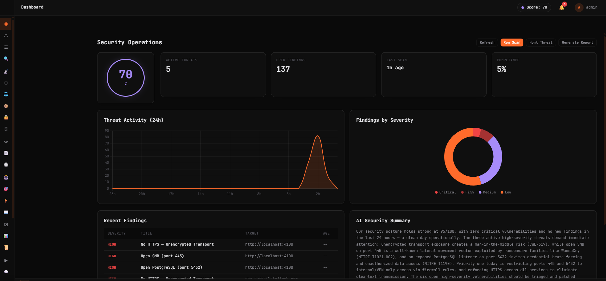

**Q: What is the security posture score?**
A: A 0-100 score calculated from open vulnerabilities (weighted by CVSS severity), compliance status, asset coverage, and scan recency. Displayed as an animated circle with letter grade (A+ to F). Color-coded: cyan (≥80), purple (≥50), orange (<50). Updates every 60 seconds via Socket.IO.

**Q: Why is my score low?**
A: Run scans to establish a baseline. The score improves as you remediate vulnerabilities, pass compliance checks, and increase scan coverage. A fresh install with no scan data starts low by design.

**Q: What does the dashboard show?**
A: Five sections: (1) Posture score circle with grade, (2) Stat cards — active threats, open findings, last scan time, compliance %, (3) Threat Activity line chart — 24h threat count per hour, (4) Findings by Severity doughnut chart, (5) Recent Findings table — last 10 with severity/title/target/age, (6) AI Security Summary — highlights (cyan), risks (orange), and recommendations generated by your AI provider.

**Q: Why does the AI summary say "unavailable"?**
A: Your AI CLI isn't configured. Go to Settings > AI Provider and select Claude CLI, Claude Code, or Codex CLI. The dashboard works without AI — only the summary section is affected.

---

### Attack Timeline

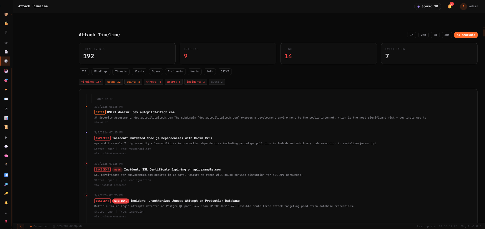

**Q: What is the Attack Timeline?**
A: A chronological view of every security event across all data sources — findings, scans, threats, alerts, incidents, hunts, OSINT lookups, auth events, and agent runs. Everything that happened, when it happened, in one stream.

**Q: How do I filter events?**
A: Two filter axes: (1) Time range — 1h, 24h (default), 7d, 30d buttons, (2) Event type pills — All, Findings, Threats, Alerts, Scans, Incidents, Hunts, Auth, OSINT. Count badges show how many events exist per type (e.g., finding:137, scan:32).

**Q: What does AI Analysis do?**
A: Click the "AI Analysis" button to send all visible events to AI. It generates a narrative identifying attack patterns, correlating events across sources, and assessing risk progression. Useful for incident response: "what happened in the last 24 hours?"

---

### Threat Feed

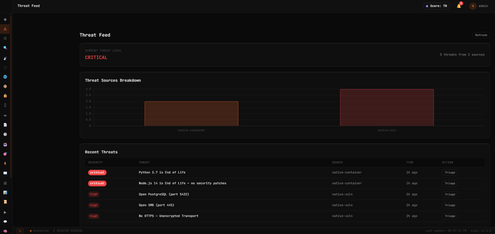

**Q: Where does threat data come from?**
A: Three sources: (1) Scan results — findings from nmap, nuclei, trivy, SSL scans, (2) Local system detection (Linux) — failed SSH attempts in auth.log, suspicious processes (xmrig, cpuminer, ncat), rogue cron jobs with curl/wget, world-writable files in /etc, (3) External feeds — CISA Known Exploited Vulnerabilities catalog.

**Q: How do I triage a threat?**
A: Click "Triage" on any row. AI acts as a senior SOC analyst and returns: verdict (true_positive / false_positive / needs_investigation), confidence % (0-100), reasoning (2-3 sentences), MITRE ATT&CK technique ID, and recommended action.

**Q: How often does the feed refresh?**
A: Every 30 seconds via Socket.IO auto-refresh when the view is active. Click Refresh for immediate update.

---

### Alert Triage

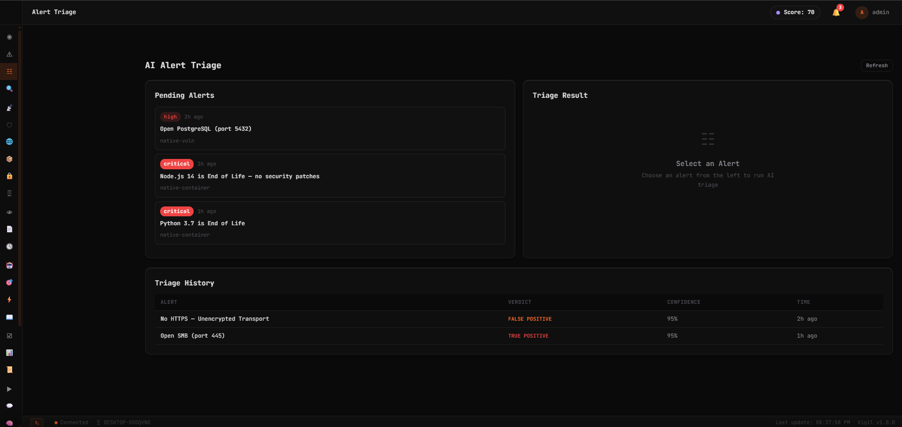

**Q: How does AI alert triage work?**
A: Pending alerts appear as cards on the left. Click any card to trigger AI analysis. The right panel shows: verdict label (color-coded), confidence % with progress bar, detailed reasoning, recommended action, and MITRE ATT&CK technique tags (purple).

**Q: What do the verdicts mean?**
A: TRUE POSITIVE (orange) = real threat, act immediately. FALSE POSITIVE (cyan) = not a real threat, safe to dismiss. NEEDS INVESTIGATION (purple) = ambiguous, human review required.

**Q: What confidence score should I trust?**
A: 85%+ is high confidence — act on the verdict. 70-85% is moderate — review the reasoning. Below 70% — always manually verify. The triage history table shows all past verdicts for audit trail.

---

### Threat Hunt

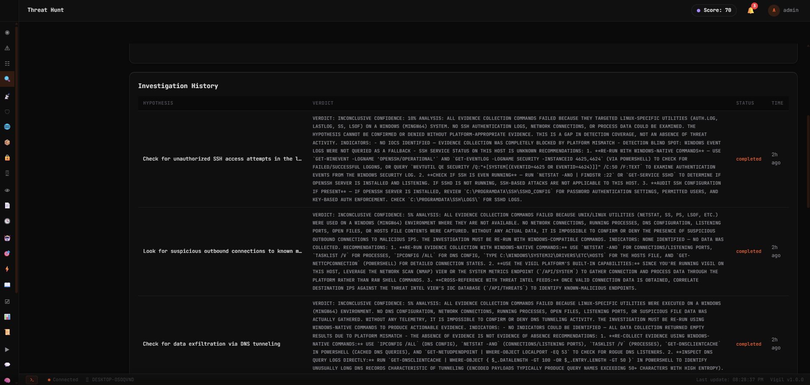

**Q: How does AI threat hunting work?**
A: Type a hypothesis in natural language (e.g., "Check for unauthorized SSH access" or "Look for lateral movement indicators"). AI forms an investigation plan, gathers evidence from all data stores (audit logs, scans, threats, alerts, findings, incidents), and delivers a verdict with detailed analysis.

**Q: What are the quick hypothesis buttons?**
A: Six pre-built hypotheses: SSH Brute Force, C2 Communication, Privilege Escalation, Lateral Movement, DNS Exfiltration, Persistence Mechanisms. Click any to pre-fill the textarea.

**Q: What does the result look like?**
A: Verdict banner (Confirmed=orange, Clear=cyan, Inconclusive=gray), Investigation Plan (AI's approach), Evidence Gathered (commands + output in code blocks with status indicators), and AI Analysis (detailed prose with findings and recommendations). Takes 15-30 seconds.

**Q: How is this different from Log Analysis?**
A: Threat Hunt is investigation-focused — forms a plan, gathers multi-source evidence, renders a verdict. Log Analysis is a single query-response for specific log searches.

---

### Vulnerability Findings

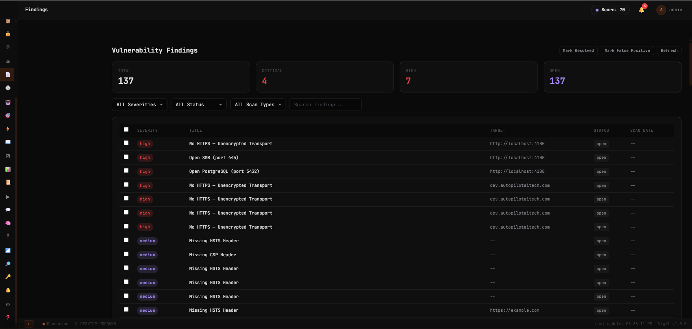

**Q: What are findings?**
A: Vulnerabilities discovered by scans, aggregated from all scan types (nmap open ports, nuclei CVEs/misconfigurations, trivy container vulns, SSL certificate issues) into one unified table.

**Q: How do I filter findings?**
A: Four filter dropdowns: Severity (all/critical/high/medium/low), Status (all/open/resolved/false_positive), Scan Type (all/nuclei/nmap/trivy/ssl), plus a text search that matches title and target.

**Q: What are bulk actions?**
A: Select findings with checkboxes, then click "Mark Resolved" or "Mark False Positive" to update multiple findings at once. Status changes are tracked with who updated and when.

**Q: How does AI analysis work per finding?**
A: Click a finding row to open the detail panel, then click "AI Analysis". AI generates: Root Cause explanation, Impact assessment, step-by-step Remediation Steps, and Risk if Unpatched. Takes ~25 seconds.

---

### Security Agents

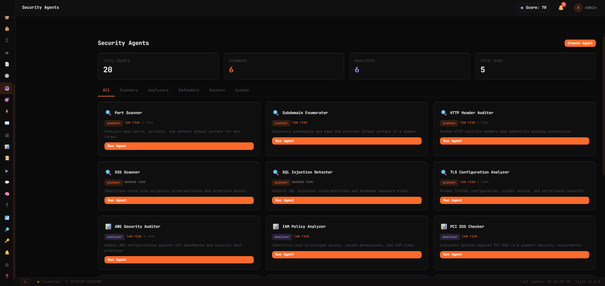

**Q: What are security agents?**
A: AI-powered specialists, each with a focused system prompt. 20 built-in agents across 5 categories: Scanners (Port Scanner, Subdomain Enumerator, HTTP Header Auditor, XSS Scanner, SQL Injection Detector, TLS Configuration Analyzer), Analyzers (AWS Security Auditor, IAM Policy Analyzer, PCI DSS Checker, Log Analyzer, Malware Analyst, Network Forensics), Defenders (Firewall Auditor, Incident Responder), Hunters (Threat Hunter, APT Detector), plus custom agents you create.

**Q: How do I run an agent?**
A: Click an agent card, enter target/input in the textarea (e.g., "192.168.1.0/24" for Port Scanner, "Check S3 bucket policies" for AWS Auditor), click Run. AI executes with 60-second timeout. Output shows with cyan border (success) or orange (error).

**Q: How do I create a custom agent?**
A: Click "Create Agent". Enter name, select category, add description, write a system prompt (defines expertise) and task prompt (with `{{input}}` template variable). If prompts are left blank, they're auto-generated.

**Q: What is risk level?**
A: Low (read-only analysis), Medium (active scanning), High (exploitation/modification). Helps operators understand impact before running.

---

### Multi-Agent Campaigns

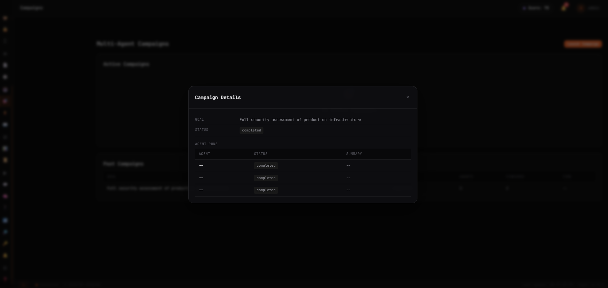

**Q: What are campaigns?**
A: Multi-agent orchestration toward a single security goal. Define what you want done (e.g., "Full security assessment of production infrastructure"), set max agents (1-10), and Vigil selects and coordinates the appropriate agents.

**Q: How does it choose which agents to run?**
A: AI selects the most relevant agents based on your goal description. A "security assessment" might use Port Scanner + HTTP Header Auditor + TLS Analyzer. A "compliance audit" might use PCI DSS Checker + AWS Security Auditor.

**Q: How do I track progress?**
A: Active campaigns show a progress bar and "X/Y agents complete" counter. Click "View Details" to see each agent's status and summary in a modal.

---

### OSINT Reconnaissance

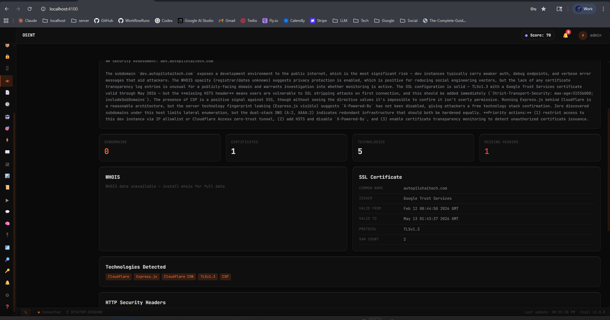

**Q: What does OSINT do?**
A: Two tabs: (1) Domain Intel — enter any domain to get WHOIS data, SSL certificate details, DNS records, subdomain discovery, technology detection, HTTP security header audit, certificate transparency log search, and AI security assessment. (2) IP Lookup — enter any IP to get geolocation, ISP/ASN info, reverse DNS, port scan (10 common ports), and AI analysis.

**Q: What security headers does it check?**
A: Seven critical headers: Strict-Transport-Security (HSTS), Content-Security-Policy (CSP), X-Frame-Options, X-Content-Type-Options, X-XSS-Protection, Referrer-Policy, Permissions-Policy. Each shown as Present (cyan) or Missing (orange).

**Q: Does it make external API calls?**
A: Domain recon uses TLS connections (SSL cert) and HTTP requests (headers/technologies). IP lookup uses ip-api.com for geolocation. No paid APIs required. History tab shows last 100 lookups.

---

### Autonomous Pentest

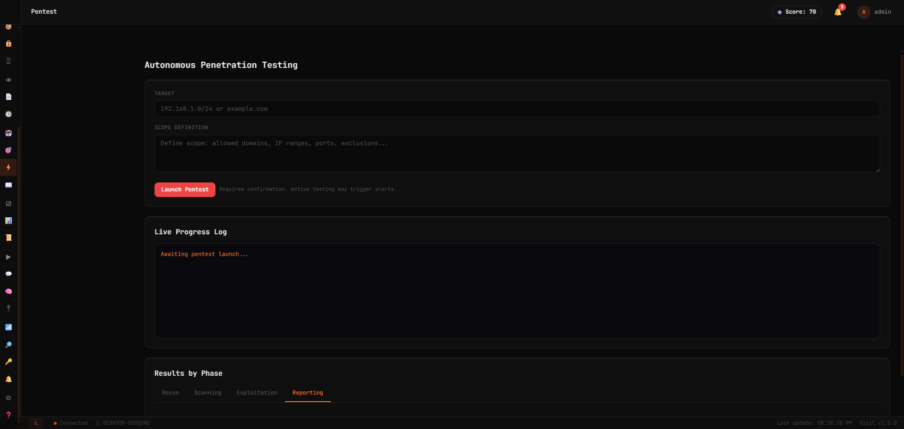

**Q: What is autonomous pentesting?**
A: Enter a target (IP/domain) and scope definition (allowed domains, ports, exclusions). Click "Launch Pentest" (requires confirmation — active testing may trigger alerts). AI orchestrates a multi-phase pentest: Recon → Scanning → Exploitation → Reporting with live progress streaming.

**Q: What phases exist?**
A: Four tabs: Recon (information gathering), Scanning (port/vulnerability scanning), Exploitation (attempting to exploit found vulnerabilities), Reporting (generating findings report). Each phase shows a table of findings with severity and details.

**Q: Is this safe to run?**
A: The orange "Launch Pentest" button includes a warning: "Requires confirmation. Active testing may trigger alerts." Only run against targets you have explicit authorization to test.

---

### Incident Response Playbooks

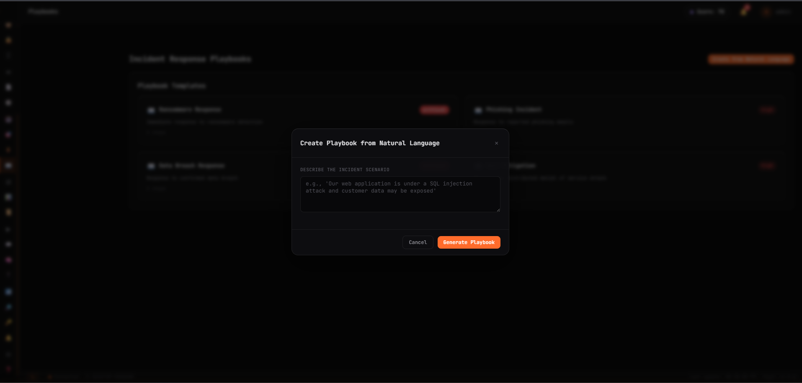

**Q: What playbooks are available?**
A: Four built-in templates: Ransomware Response (critical), Phishing Incident (high), Data Breach Response (critical), Account Compromise (high). Each is a step-by-step checklist covering triage, containment, eradication, recovery, and post-incident phases.

**Q: How do I create a custom playbook?**
A: Click "Create Playbook from Natural Language". Describe your incident scenario (e.g., "Our web application is under a SQL injection attack and customer data may be exposed"). Click "Generate Playbook". AI creates a full step-by-step response plan.

**Q: Can I execute playbook steps?**
A: Yes. Click any playbook to open it. Each step has a checkbox (toggle completion) and an Execute button for automated steps.

---

### Compliance Frameworks

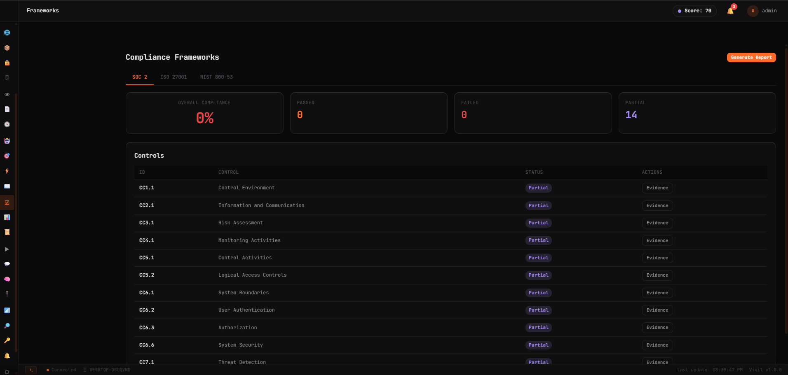

**Q: Which frameworks are supported?**
A: SOC 2 Type II, ISO 27001, and NIST 800-53. Each framework tab shows: Overall Compliance %, Passed/Failed/Partial control counts, and a Controls table with ID, name, status badge, and Evidence button.

**Q: What does "Partial" status mean?**
A: The control is partially implemented. Some checks pass but others fail. Click Evidence to see what's missing and what's been collected.

**Q: How do I generate a compliance report?**
A: Click "Generate Report" in the top-right. AI produces a compliance readiness report with executive summary, current state, strengths, risks, and remediation priorities.

---

### Reports

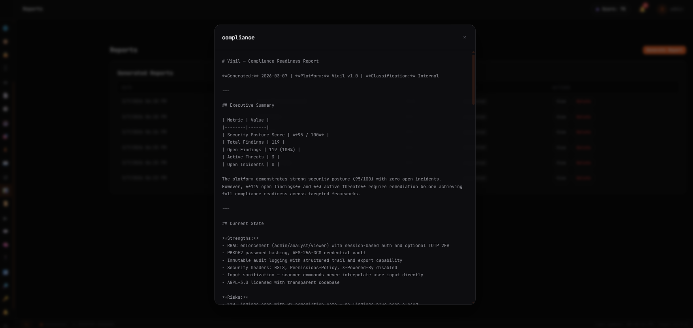

**Q: What report types exist?**
A: Five types: Security Audit (full assessment), Vulnerability Report (findings by severity), Compliance Report (framework status + gaps), Incident Report (history + response metrics), Executive Summary (high-level briefing for leadership).

**Q: What does a report contain?**
A: Executive Summary table (posture score, total/open findings, active threats, open incidents), Current State assessment, Strengths, Risks, and Recommendations. Generated by AI analyzing all your security data.

---

### AI Terminal

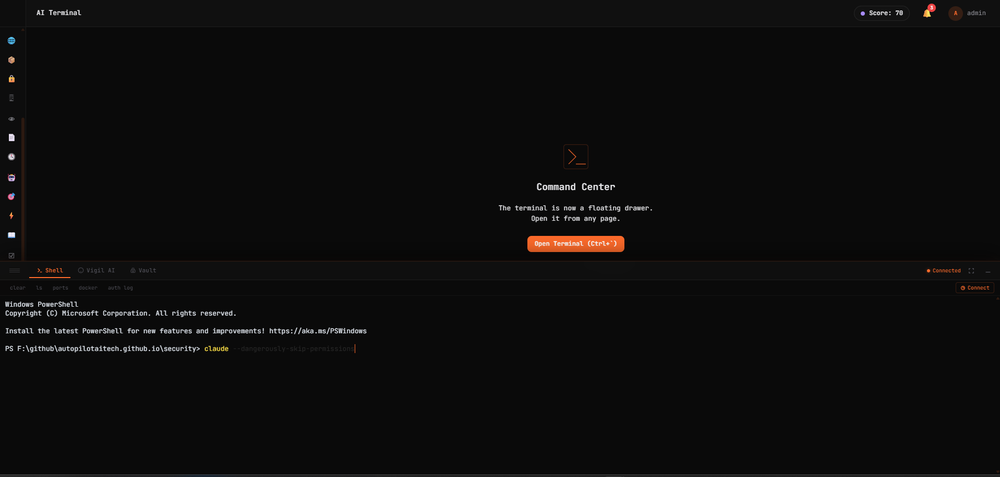

**Q: What is the AI Terminal?**
A: Three-in-one command center in a floating drawer (Ctrl+`): (1) Shell — full interactive terminal (xterm.js) for running any command, (2) Vigil AI — natural language security assistant with quick action buttons (posture check, scan ports, check SSL, analyze auth log, list vulnerabilities, generate report), (3) Vault — browse encrypted credentials.

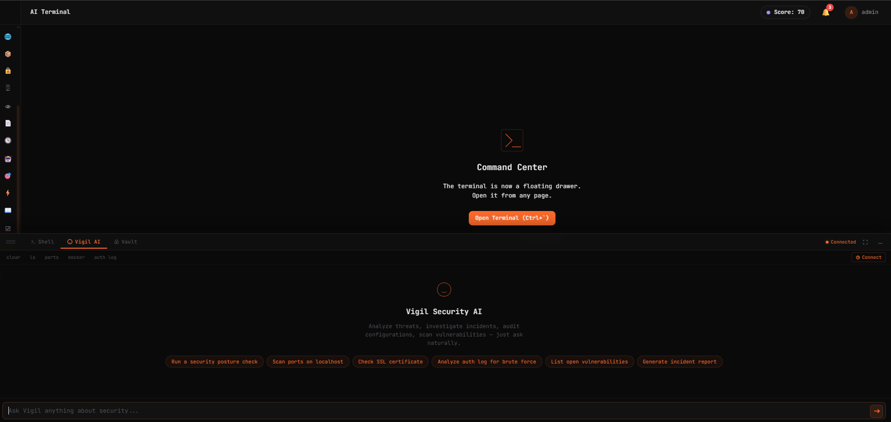

**Q: Does the terminal persist across page navigation?**
A: Yes. It's a floating drawer that stays open when switching views. Shell session maintained via Socket.IO. Quick command buttons: clear, ls, ports, docker, auth log.

---

### Audit Log

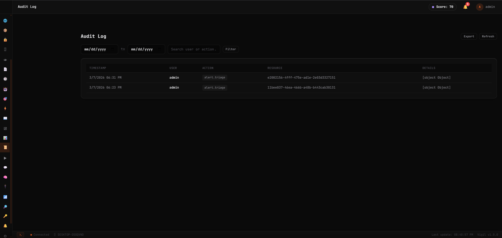

**Q: What is logged?**
A: Every action: logins, scans, triage operations, agent runs, setting changes, credential access, incident updates. Columns: Timestamp, User, Action (e.g., alert.triage, scan.start, auth.login), Resource (UUID), Details.

**Q: Is it tamper-proof?**
A: Entries are append-only with cryptographic checksums. Each entry references the previous hash, forming a chain. Filter by date range and user/action search. Export as JSON.

---

### Credential Vault

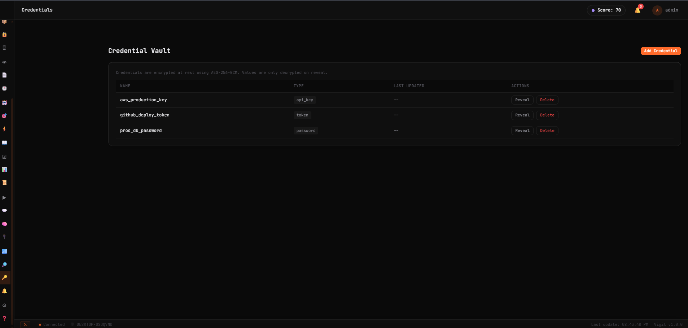

**Q: How secure is the vault?**
A: AES-256-GCM encryption with unique IV per credential. Values encrypted at rest, only decrypted on-demand when you click Reveal. Encryption key stored in .env (ENCRYPTION_KEY). Types supported: api_key, token, password, secret.

---

### Notifications

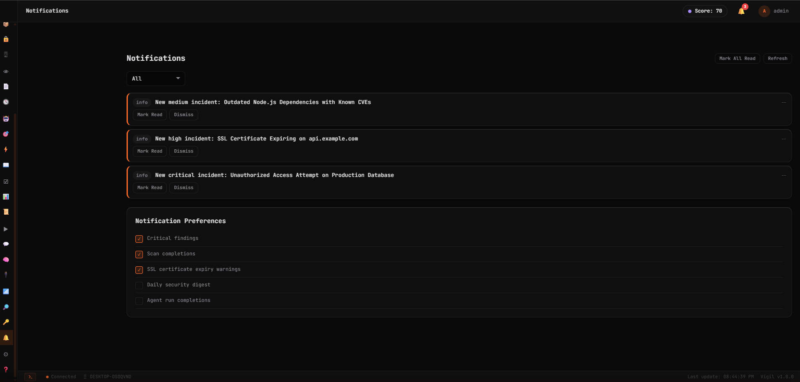

**Q: What triggers notifications?**
A: New incidents, scan completions, critical findings, SSL certificate expiry warnings. Configurable via Notification Preferences checkboxes: Critical findings, Scan completions, SSL expiry (enabled by default), Daily security digest, Agent run completions (optional).

---

### MCP Playground

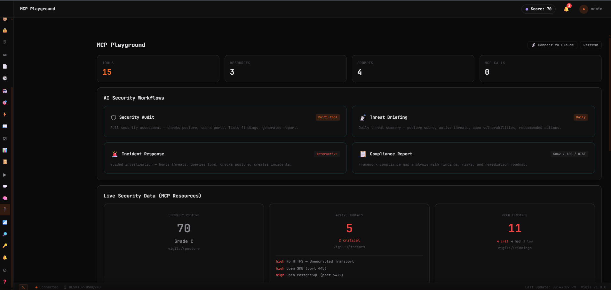

**Q: What is the MCP Playground?**
A: Interactive testing interface for Vigil's built-in MCP server. 5 zones: stats bar (15 tools, 3 resources, 4 prompts), AI Security Workflows (Security Audit, Threat Briefing, Incident Response, Compliance Report), Live Security Data (posture score, active threats, open findings from MCP resources), Tool Explorer (search/filter/execute any tool with auto-generated parameter forms), and Request Log.

**Q: How do I connect Claude Desktop or Claude Code?**
A: Click "Connect to Claude" for setup instructions. Claude Code: `claude mcp add vigil --transport http http://localhost:4100/mcp`. Claude Desktop: add to config JSON. The MCP endpoint is `POST /mcp` (Streamable HTTP transport).

---

### Knowledge Base

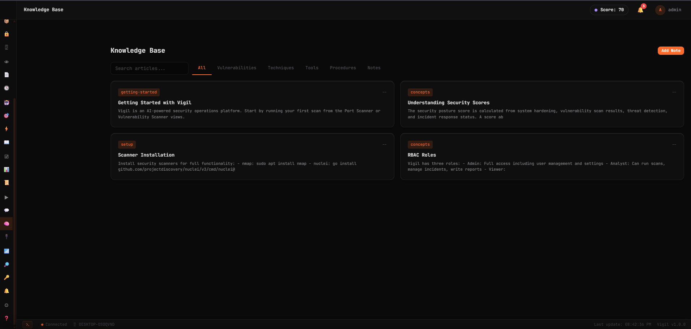

**Q: What is the Knowledge Base?**
A: Searchable security reference articles (Getting Started, Security Scores, Scanner Installation, RBAC Roles) plus custom note-taking. Filter by category: All, Vulnerabilities, Techniques, Tools, Procedures, Notes. Click "Add Note" to create your own SOPs, runbooks, and investigation notes.

---

### Settings

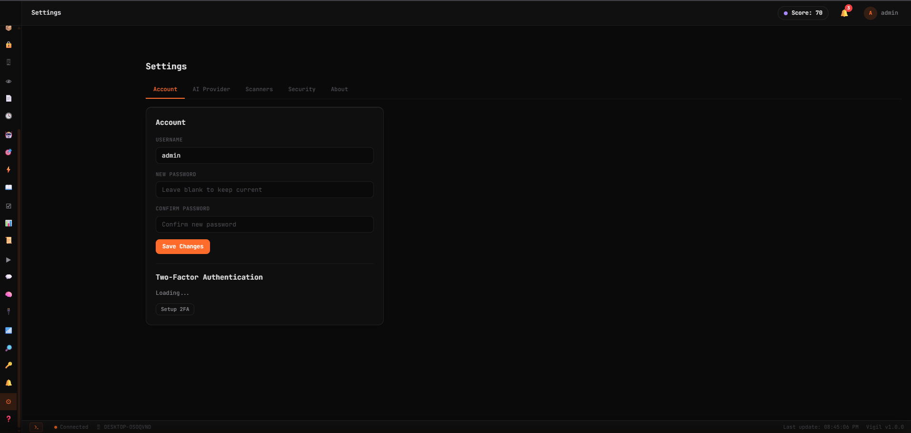

**Q: What tabs are in Settings?**
A: Five tabs: Account (username, password, 2FA), AI Provider (Claude CLI / Claude Code / Codex CLI / None), Scanners (verify installed tools + paths), Security (session timeout, password policy), About (version, OS, uptime, license).

**Q: How do I enable 2FA?**
A: Settings > Account > Two-Factor Authentication > Setup 2FA. Scan QR code with any TOTP app (Google Authenticator, Authy, 1Password). Enter 6-digit code to verify. Save backup codes.

**Q: What happens if AI is set to "None"?**
A: All views work. AI features (triage, hunting, playbooks, analysis, summaries) show "AI not configured" messages. Scanning, findings, compliance, reports, and all data views remain fully functional.

---

### Log Analysis

**Q: How does natural language log analysis work?**
A: Enter a plain English query like "Show me failed login attempts" or "What scans ran today?". AI searches 9 internal data stores (audit-log, scans, threats, alerts, findings, incidents, agent-runs, hunts, ssl-domains, osint-history) and generates analysis with trends and recommendations.

**Q: Does it only work on Linux?**
A: No. Vigil queries its own internal data stores cross-platform (Windows, macOS, Linux). On Linux, it can additionally query system logs (syslog, auth.log, systemd journal).

### Network Scan
**Q: Which nmap flags are used?**
A: Depends on profile: Quick (`-F -T4`, ~15s), Standard (`-sV -T3`, ~2min), Full (`-sV -sC -O -p-`, ~15min), Stealth (`-sS -T2`, ~5min). Custom flags supported.

### Vuln Scan
**Q: How are nuclei templates updated?**
A: Run `nuclei -update-templates` on the server. 9000+ community templates stored in `~/.nuclei-templates/`.

### Container Scan
**Q: Why does container scan fail?**
A: Trivy must be installed and Docker socket accessible. Check `DOCKER_HOST` in `.env` and ensure vigil user has Docker group membership.

### SSL Audit
**Q: What grades are possible?**
A: A+ (HSTS + strong ciphers + TLS 1.2+), A, B (TLS 1.1), C (weak ciphers), D (TLS 1.0), F (expired/self-signed).

### DNS Recon
**Q: What is a zone transfer test?**
A: Tests if DNS server allows AXFR queries, which would expose all DNS records. A successful transfer is a misconfiguration finding.

### Scan History
**Q: How long are scan results retained?**
A: Indefinitely. JSON file store retains last 1000 scans. Full scan details available via `GET /api/scans/:id`.

### Docs/FAQ
**Q: Where is the full documentation?**
A: In the Docs/FAQ sidebar view (this page), which provides getting-started guide, views FAQ with screenshots, API reference, scanner setup, and keyboard shortcuts.

---

## Troubleshooting

### Server won't start
```
Error: listen EADDRINUSE :::4100
```
Another process is using port 4100. Either stop it or change `VIGIL_PORT` in your `.env`.

### Nmap scan fails
```
Error: nmap not found
```
Install nmap: `sudo apt-get install -y nmap`. Or set `NMAP_PATH` in `.env` to the full path.

### Nuclei scan fails
```
Error: nuclei not found
```
Install nuclei from https://github.com/projectdiscovery/nuclei/releases or use the Docker setup which includes it.

### Trivy scan fails
```
Error: trivy not found
```
Install trivy: `curl -sfL https://raw.githubusercontent.com/aquasecurity/trivy/main/contrib/install.sh | sudo sh -s -- -b /usr/local/bin`

### Docker scanning unavailable
```
Error: Cannot connect to Docker daemon
```
Ensure Docker is installed and the socket is accessible. Add the vigil user to the docker group: `sudo usermod -aG docker vigil`

### Database connection refused
```
Error: connect ECONNREFUSED 127.0.0.1:5432
```
If using PostgreSQL, ensure it is running. Vigil works without a database (uses JSON file stores), so you can also remove `DATABASE_URL` from `.env`.

### AI features not working
```
Error: claude: command not found
```
Install the AI CLI: `npm install -g @anthropic-ai/claude-code`. Ensure you have an active subscription with the AI provider. Set `AI_PROVIDER` in Settings or `.env`.

### Login fails after restart
Session tokens are stored in `data/sessions.json`. If this file is missing or corrupted, clear your browser cookies and log in again with the default credentials.

### High memory usage
Vigil itself uses minimal memory (~50-80MB). Scanner processes (especially nuclei with many templates) can use significant memory. Use the `SCAN_TIMEOUT` env var to limit long-running scans.

### Permission denied on scans
Some scanners (especially nmap SYN scan) require root privileges. Either run Vigil as root (not recommended) or configure nmap with capabilities: `sudo setcap cap_net_raw+ep /usr/bin/nmap`
